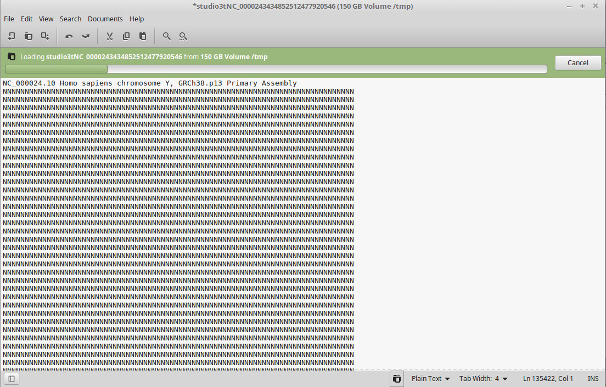
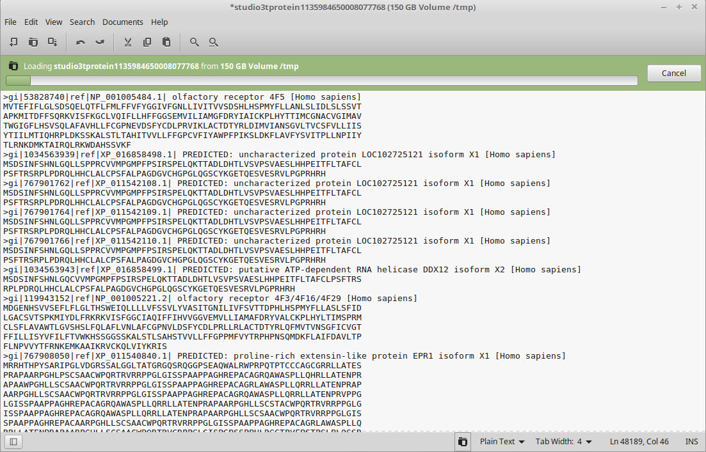
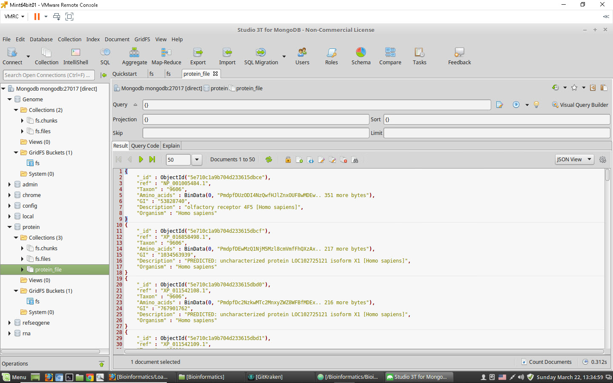

#Bioinformatics
##Continuation of Bioinformatics project -- Dr. Bagga and Dr. Frees.

This self-assigned project is to convert the MongoDB collections in the "chrome" database into various GridFS databases.

The first step is to select files to upload from the NCBI databases (which are zipped), FTP them to my Ubuntu (Linux) file server and then unzip them.

The next step is to create BASH scripts that upload the files into mongodb databases using the "mongofiles" utility. The BASH scripts are in the 'scripts' folder.

Finally Python programs read the GridFS collections/chunks and create either new GridFS files/chunks or create "regular" collections in the databases, depending on the size of the data. Generally speaking, chromosomes/genomes are left as GridFS objects;  genes, rna, and protein collections are created as regular collections.

##Technical specs
###Programming Folder Structure
There are seven folders:
1. Build_collections: this contains the Python programs that create collections in the Mongo database. This works in conjunction with the BASH scripts in the 'scripts' folder.
2. Find_regex_pattern_gridfs: this contains Python programs utilizing the new Mongo database collections to perform REGEX finds of nucleotide data. This is based on the "Nucleotide_search" folder (see below).
3. HWtranslatereadingframe: this contains Perl programs, one is the original program from the Ramapo College Perl scripting class, the other is the same program modified to use a genbank file rather than a text file, and do a REGEX search that is uppercase rather than lowercase.
4. Nucleotide_search: This contains the original self-assigned Nucleotide search programs written to perform searches using the "chrome" database from the Ramapo College Bioinformatics project.
5. Sandbox: this folder contains programs strictly for trial-and-error coding techniques to learn REGEX, etc.
6. scripts: contains BASH scripts that copy NCBI fast files into MongoDB GridFS collections.
7. Supporting_documentation: Includes screen caps used with this README.md, etc.

